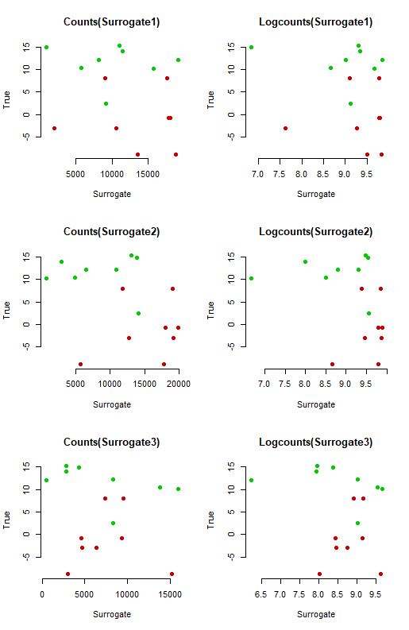
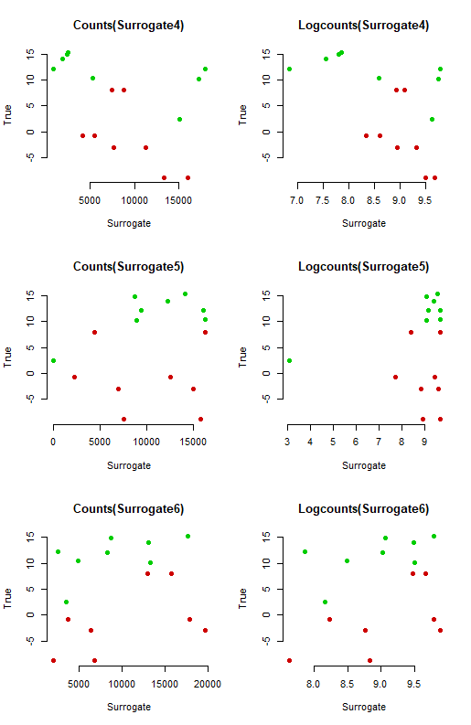
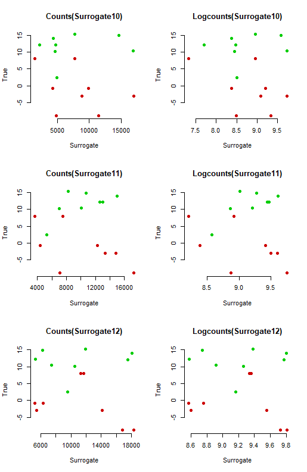
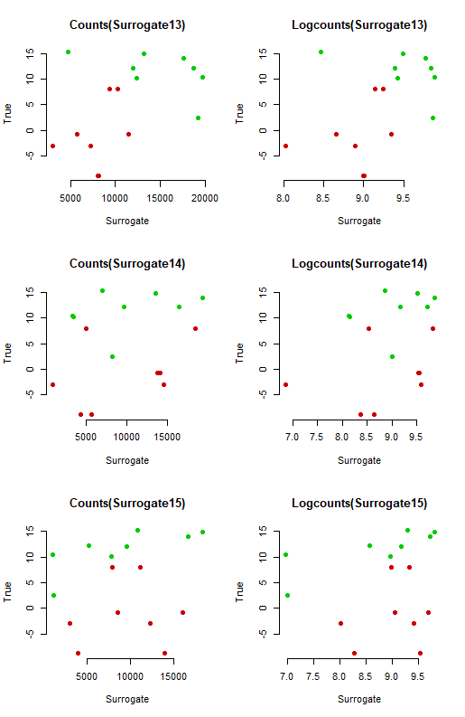
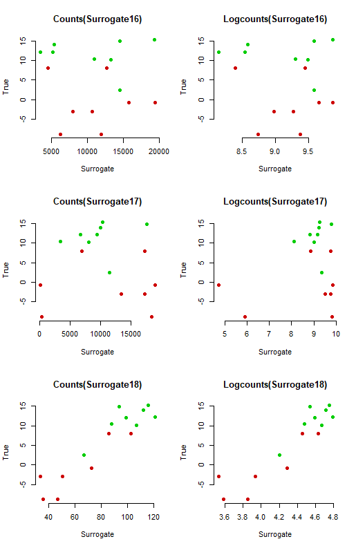
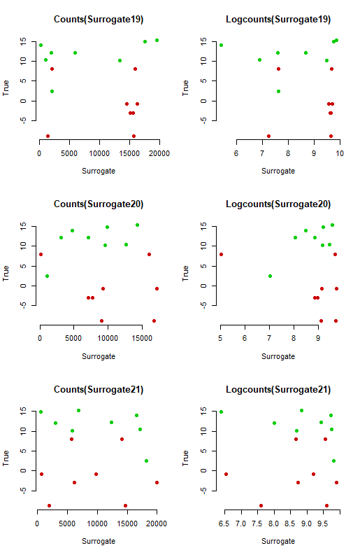

Exploratory Analysis
========================================================
author: Olusoji Oluwafemi Daniel
date: 
autosize: true

Exploratory Analysis
========================================================




Slide With Code
========================================================


```
     speed           dist       
 Min.   : 4.0   Min.   :  2.00  
 1st Qu.:12.0   1st Qu.: 26.00  
 Median :15.0   Median : 36.00  
 Mean   :15.4   Mean   : 42.98  
 3rd Qu.:19.0   3rd Qu.: 56.00  
 Max.   :25.0   Max.   :120.00  
```

Slide With Plot
========================================================


